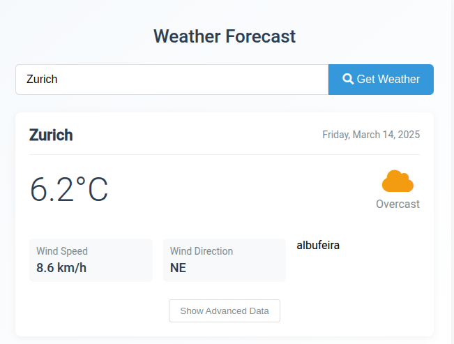

## **📌 README.md**
# 🌤️ Weather App (Angular + C# .NET API)

A **full-stack weather application** built with **Angular (frontend)** and **C# .NET Web API (backend)**.  
The app allows users to **search for a city**, retrieves its **latitude and longitude** using **Nominatim API**,  
and then fetches **real-time weather data** from **Open-Meteo API**.


## 🚀 Features
✅ **Search Weather by City (with Geocoding API)**  
✅ **Live Weather Updates (Temperature, Wind Speed, Humidity, etc.)**  
✅ **Modern and Responsive UI (Angular Frontend)**  
✅ **C# .NET Web API as Backend**  
✅ **Weather Icons & Descriptions**  
✅ **Toggle Advanced Weather Data (JSON Response)**  
✅ **Error Handling for Invalid Cities**  

---

## 📸 Screenshot

---

## 🛠️ Installation & Setup

### **1️⃣ Clone the Repository**
```sh
git clone git@github.com:FilipeanSilva/Weather.git
cd weather-app
```

---

## **🔹 Backend Setup (C# .NET Web API)**
### **2️⃣ Navigate to Backend Folder**
```sh
cd WeatherApp_BE
```

### **3️⃣ Install Dependencies**
```sh
dotnet restore
```

### **4️⃣ Run the C# Backend**
```sh
dotnet run
```
> The API will be available at **`http://localhost:5103/api/weather`**.

---

## **🔹 Frontend Setup (Angular)**
### **5️⃣ Navigate to Frontend Folder**
```sh
cd Angular
```

### **6️⃣ Install Dependencies**
```sh
npm install
```

### **7️⃣ Start Angular Frontend**
```sh
ng serve
```
> Open **`http://localhost:4200`** in your browser.

---

## 🔧 Technologies Used
### **Frontend (Angular)**
- Angular (Standalone Components)
- TypeScript
- Responsive CSS

### **Backend (C# .NET API)**
- ASP.NET Core Web API
- HttpClient for API Calls
- Open-Meteo API (Weather Data)
- Nominatim API (Geocoding)

---

## 🌍 API Integration
This app fetches **live weather data** using two APIs:

1. **Geocoding API (Nominatim OpenStreetMap)**  
   - Converts a **city name** into **latitude & longitude**.  
   - API Endpoint:  
     ```
     https://nominatim.openstreetmap.org/search?q=Zurich&format=json
     ```
   - **Example Response:**
     ```json
     [
       {
         "lat": "47.3768866",
         "lon": "8.541694"
       }
     ]
     ```

2. **Weather API (Open-Meteo)**  
   - Fetches **weather data** based on latitude & longitude.  
   - API Endpoint:
     ```
     https://api.open-meteo.com/v1/forecast?latitude=47.3769&longitude=8.5417&current_weather=true
     ```
   - **Example Response:**
     ```json
     {
       "current_weather": {
         "temperature": 22.5,
         "windspeed": 10,
         "humidity": 55
       }
     }
     ```

### **Backend Workflow**
1. User **enters a city name** in the Angular UI.
2. **Frontend sends a request** to the C# backend.
3. **Backend fetches coordinates** from **Nominatim API**.
4. **Backend fetches weather data** from **Open-Meteo API**.
5. **Backend returns formatted data** to the frontend.

### **Example API Call**
```
GET http://localhost:5103/api/weather/city?city=Zurich
```
📌 **Response Example:**
```json
{
  "city": "Zurich",
  "temperature": 22.5,
  "wind_speed": 10,
  "humidity": 55,
  "description": "Partly Cloudy"
}
```

---

## 📜 Usage Guide
1. **Enter a city name** in the search box.
2. Press `Enter` or click **Get Weather**.
3. View **temperature, wind speed, humidity, and weather conditions**.
4. Click **"Show Advanced Data"** to see raw JSON response.

---

## 🎨 UI Design
### **Weather Card Layout**
- **Search Box**: Allows searching by city name.
- **Weather Details**: Displays key weather parameters.
- **Icons & Descriptions**: Uses `getWeatherIcon()` and `getWeatherDescription()` functions.
- **Advanced Data Toggle**: View JSON response for debugging.

---